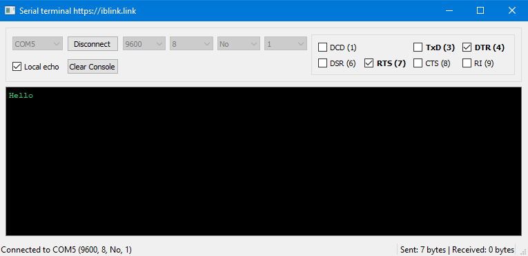

# Serial Terminal



A simple, fast, and cross-platform RS-232 serial terminal application for serial communication, device control, and debugging.

## Features

- **Data Transmission**: Send and receive serial data in real time.
- **RS-232 Control Lines**: Control output lines (such as RTS and DTR).
- **Pin Status Monitoring**: Monitor input status lines (CTS, DSR, DCD, RI).
- **Traffic Counter**: Track sent and received byte counts.
- **Local Echo**: Toggle local echo to view transmitted characters in the terminal console.

## Supported Platforms

- **Windows**: Supported with standalone NSIS installers and MSVC build support.
- **Linux**: Supported with native `.deb` packaging and CMake/Qt5 build support.
- **macOS**: Planned for future releases.


### Linux additional steps

```shell
# grant user access to the dialout group
sudo usermod -a -G dialout $USER
# then reboot machine or log out and back in.
```
